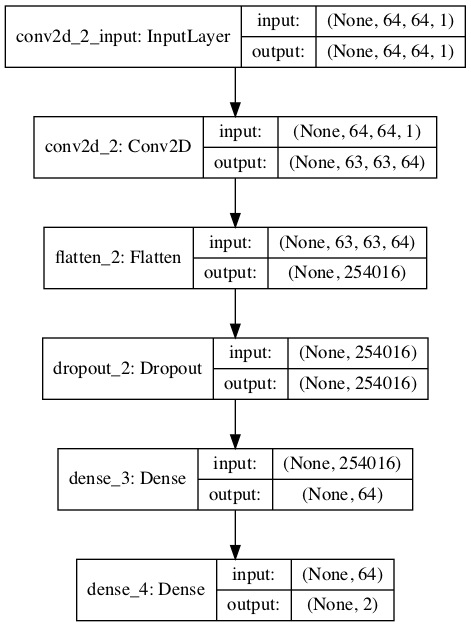

# DNNs for Recognizing Phase Transitions

 Explorations into using DNNs for recognizing phase transitions of matter.
 The code is primarily an attempt to recreate the results of Carrasquilla and Melko [1],
 in which a CNN is applied to various states of a ferromagnetic system
 described by a 2D Ising model.

 The Ising model states are generated using the Monte Carlo method (Hastings-Metropolis algorithm).
 I followed the methodology of [2] for the Monte Carlo solver.

 As in [1], the CNN applied to the Ising lattices is able to recognize
 whether the system is above or below the critical temperature of the phase
 transition with 100% accuracy.  

## Monte Carlo-generated Ising Lattices:

## Thermodynamic Variables

## CNN Architecture (64x64 Lattice State)

# References:

[1] J. Carrasquilla and R. G. Melko, “Machine learning phases of matter,” Nature Physics, vol. 13, no. May 2017, doi: 10.1038/NPHYS4035.

[2] https://rajeshrinet.github.io/blog/2014/ising-model/#Monte-Carlo-simulation-of-2D-Ising-model

[3] https://en.wikipedia.org/wiki/Ising_model
